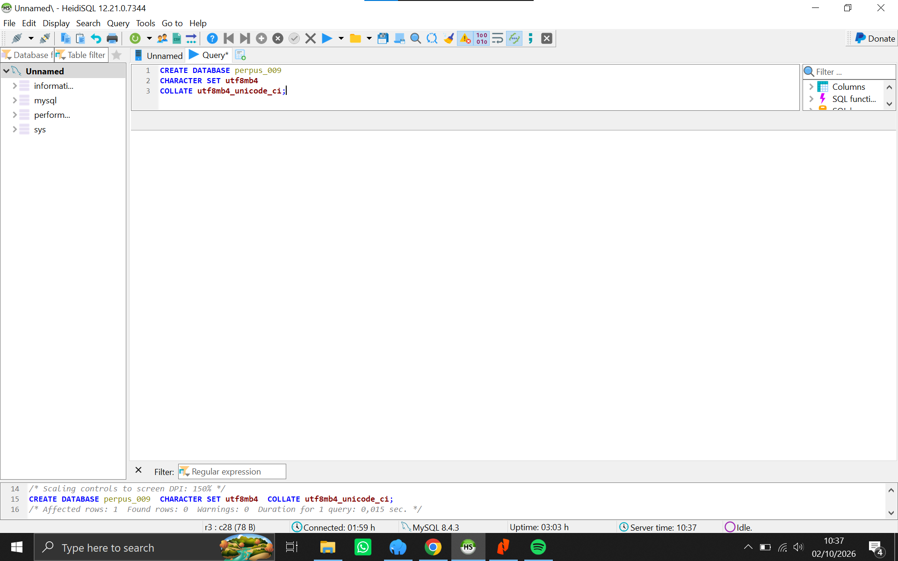
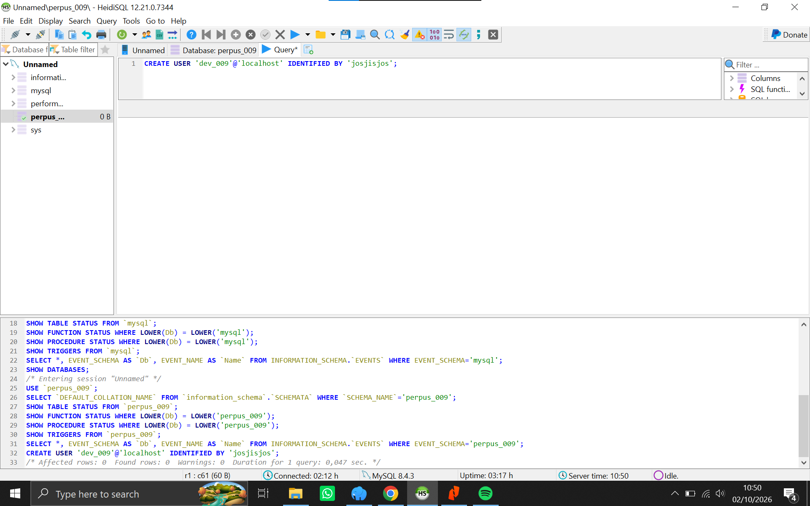
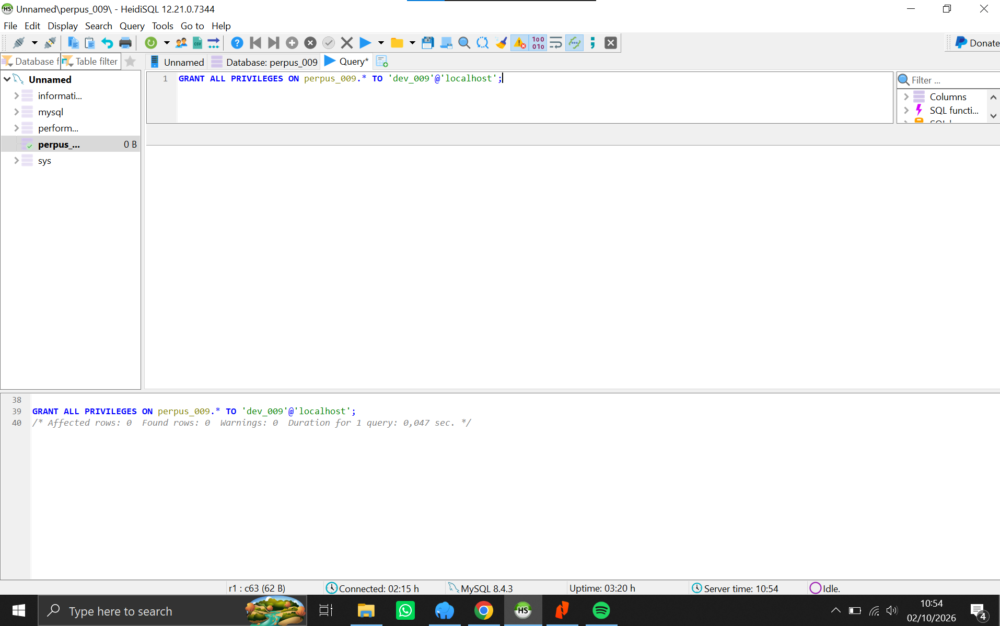
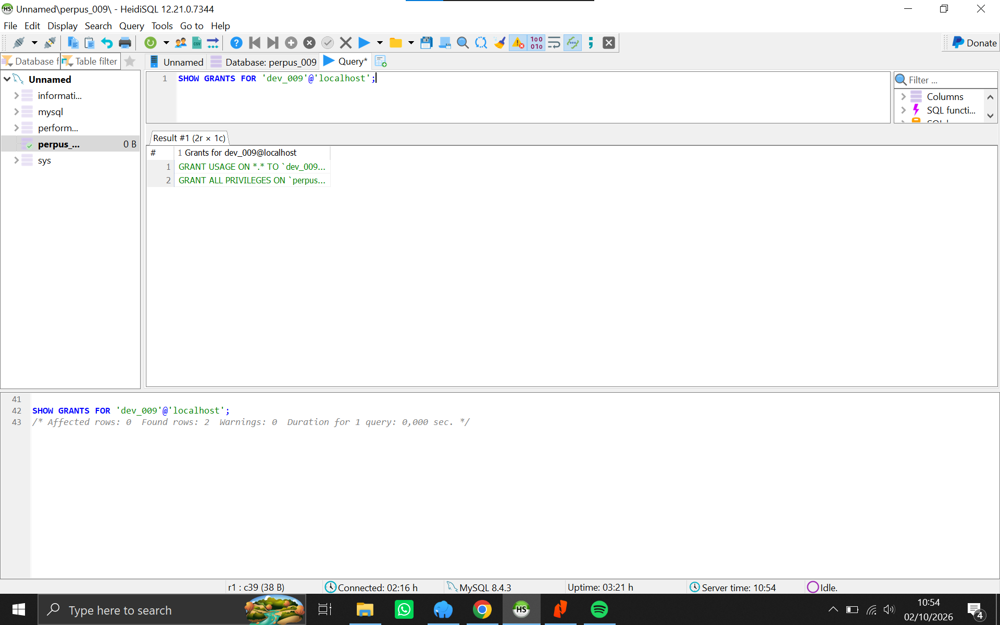
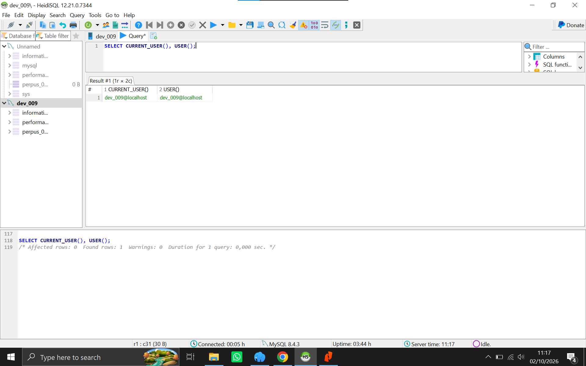
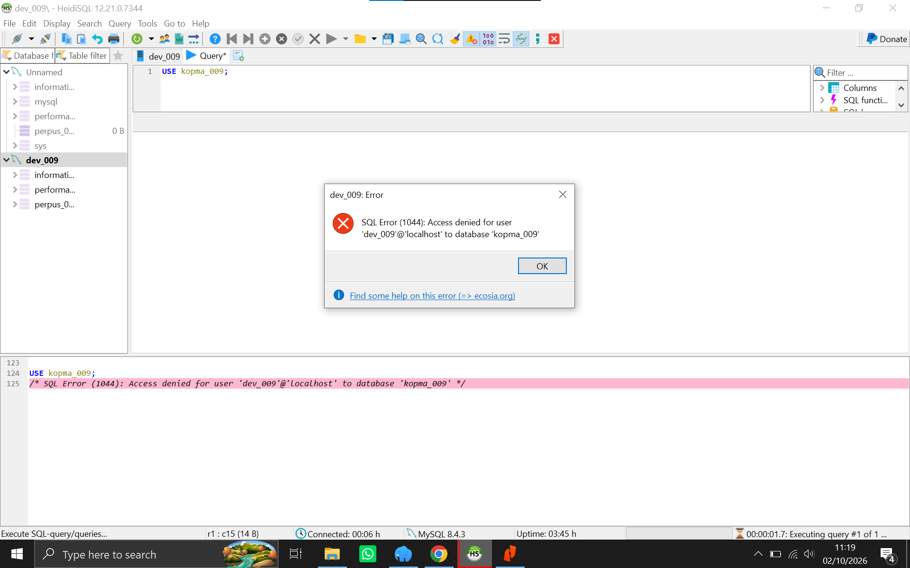

# Laporan Praktikum Basis Data - Pertemuan 1

- Nama: Abbiyu Hashfi Dzakwan  
- NPM: 25430009  
- Kelas: A

## 1. Tujuan Praktikum

Praktikum Pertemuan 1 bertujuan untuk memahami lingkungan kerja MariaDB, membuat basis data dan akun pengguna dengan hak akses yang sesuai, serta memahami penggunaan Git dan GitHub sebagai tempat penyimpanan dan dokumentasi proyek basis data.

Pada praktikum ini juga dilakukan pengujian hak akses akun kerja untuk memastikan akun tersebut hanya dapat mengakses basis data proyek yang telah ditentukan.

## 2. Ringkasan Dasar Teori

MariaDB merupakan sistem manajemen basis data relasional yang digunakan untuk menyimpan dan mengelola data menggunakan SQL. Dalam pengelolaan basis data, akun root digunakan untuk melakukan administrasi seperti membuat basis data, membuat pengguna, dan memberikan hak akses.

Akun kerja dibuat dengan hak akses yang terbatas sesuai kebutuhan proyek. Pemberian hak akses terbatas merupakan penerapan prinsip least privilege, yaitu pengguna hanya diberikan hak yang diperlukan untuk menjalankan tugasnya.

Git digunakan untuk mencatat perubahan pekerjaan secara bertahap, sedangkan GitHub digunakan sebagai tempat penyimpanan repositori proyek dan bukti perkembangan pekerjaan.

## 3. Hasil Langkah Percobaan

### 3.1 Pembuatan Basis Data Proyek

Basis data proyek dibuat dengan nama:

`perpus_009`

Basis data menggunakan karakter set `utf8mb4` dan collation `utf8mb4_unicode_ci`.

Perintah yang digunakan:

```sql
CREATE DATABASE perpus_009
CHARACTER SET utf8mb4
COLLATE utf8mb4_unicode_ci;
```

Hasil eksekusi menunjukkan bahwa perintah berhasil dijalankan tanpa warning.

**Bukti:**



### 3.2 Pembuatan Akun Kerja

Akun kerja proyek dibuat dengan nama:

`dev_009`

Perintah yang digunakan:

```sql
CREATE USER 'dev_009'@'localhost'
IDENTIFIED BY '<josjisjos>';
```

Password digunakan sebagai kredensial untuk login akun kerja pada lingkungan lokal.

**Bukti:**



### 3.3 Pemberian Hak Akses

Akun `dev_009` diberikan hak akses terhadap basis data proyek `perpus_009`.

Perintah yang digunakan:

```sql
GRANT ALL PRIVILEGES
ON perpus_009.*
TO 'dev_009'@'localhost';
```

Hak akses kemudian diperiksa menggunakan:

```sql
SHOW GRANTS FOR 'dev_009'@'localhost';
```

Hasil pemeriksaan menunjukkan bahwa `dev_009` memperoleh hak akses pada `perpus_009.*`.

**Bukti:**




### 3.4 Verifikasi Akun yang Digunakan

Untuk memastikan koneksi benar-benar menggunakan akun kerja, dijalankan:

```sql
SELECT CURRENT_USER(), USER();
```

Hasil menunjukkan bahwa koneksi menggunakan akun:

dev_009@localhost

Dengan demikian koneksi yang digunakan merupakan akun `dev_009`, bukan akun root.

**Bukti:**



### 3.5 Pengujian Pembatasan Hak Akses

Untuk menguji pembatasan akses, digunakan basis data:

`kopma_009`

Kemudian akun `dev_009` mencoba mengakses basis data tersebut.

Hasil pengujian menghasilkan error:

ERROR 1044:
Access denied for user 'dev_009'@'localhost' to database 'kopma_009'

Hal tersebut menunjukkan bahwa akun `dev_009` tidak memiliki hak untuk mengakses `kopma_009`.

Sebaliknya, akun tersebut memiliki hak akses terhadap basis data proyek `perpus_009`.

**Bukti:**



## 4. Jawaban Titik Analisis

### Titik Analisis 1

Akun kerja tidak menggunakan akun root untuk pekerjaan sehari-hari karena akun root memiliki hak akses administratif yang sangat luas. Jika akun root digunakan untuk pekerjaan sehari-hari, kesalahan dalam menjalankan perintah dapat berdampak pada basis data atau objek lain yang berada pada server.

Oleh karena itu digunakan akun kerja `dev_009` yang hak aksesnya dibatasi pada basis data proyek `perpus_009`.

### Titik Analisis 2

Akun `dev_009` dapat membuka `perpus_009`, tetapi tidak dapat membuka `kopma_009` karena hak akses diberikan secara khusus pada basis data `perpus_009`.

Perintah yang digunakan:

```sql
GRANT ALL PRIVILEGES
ON perpus_009.*
TO 'dev_009'@'localhost';
```

Hak tersebut berlaku untuk objek di dalam `perpus_009`, bukan untuk seluruh basis data pada server.

Ketika `dev_009` mencoba membuka `kopma_009`, MariaDB menolak akses karena akun tersebut tidak mempunyai privilege pada basis data tersebut.

### Titik Analisis 3

Perbedaan error 1044, 1045, dan 1142 dapat dijelaskan sebagai berikut:

| Error | Permasalahan |
|---|---|
| 1044 | Pengguna tidak memiliki akses ke database |
| 1045 | Pengguna gagal melakukan autentikasi/login |
| 1142 | Pengguna tidak memiliki privilege untuk menjalankan operasi tertentu |

Error 1044 berkaitan dengan penolakan akses terhadap database.

Error 1045 berkaitan dengan kegagalan autentikasi ketika pengguna mencoba login ke server MariaDB. Penyebabnya dapat berupa username atau password yang tidak sesuai.

Error 1142 menunjukkan bahwa pengguna telah berhasil terhubung ke server, tetapi tidak memiliki privilege untuk menjalankan operasi tertentu terhadap objek database, seperti `SELECT`, `CREATE`, atau operasi lainnya.

### Titik Analisis 4

Mode autentikasi cookie pada phpMyAdmin meminta pengguna memasukkan kredensial ketika melakukan login. Sementara itu, mode config dapat menyimpan informasi autentikasi pada berkas konfigurasi sehingga login dapat dilakukan secara otomatis.

Mode cookie lebih sesuai digunakan ketika ingin menghindari penyimpanan kredensial login secara langsung pada konfigurasi phpMyAdmin.

Pada praktikum ini pengelolaan database dilakukan menggunakan HeidiSQL sesuai lingkungan kerja yang digunakan.

## 5. Hasil Latihan dan Modifikasi

### 5.1 Pengujian Hak Akses

Pengujian dilakukan menggunakan akun kerja `dev_009`.

Akun tersebut berhasil digunakan untuk mengakses basis data proyek `perpus_009`.

Ketika mencoba mengakses `kopma_009`, MariaDB menghasilkan error 1044. Hasil tersebut membuktikan bahwa akun kerja tidak mempunyai hak akses terhadap database tersebut.

### 5.2 Skrip Lingkungan

Berkas SQL proyek dibuat dengan nama:
p01_lingkungan_25430009.sql

Berkas tersebut digunakan untuk menyimpan perintah yang berkaitan dengan pembuatan lingkungan proyek basis data.

## 6. Tugas Mandiri: Milestone Proyek 1

Proyek praktikum menggunakan tema Perpustakaan berdasarkan dua digit terakhir NPM.

NPM:
25430009

Dua digit terakhir:
09

Angka `09` termasuk dalam rentang tema Perpustakaan.

Identitas proyek:

| Komponen | Nilai |
|---|---|
| Tema | Perpustakaan |
| Kode Tema | `perpus` |
| Kode 3 Digit | `009` |
| Database | `perpus_009` |
| Akun Kerja | `dev_009` |
| Repository | `basisdata-25430009` |

Nama organisasi fiktif yang digunakan dalam proyek adalah:

**Perpustakaan AHD**

Perpustakaan AHD merupakan organisasi fiktif yang menyediakan layanan pengelolaan anggota, katalog buku, peminjaman, pengembalian, dan denda. Basis data proyek akan dikembangkan secara bertahap untuk mendukung pengelolaan data dan aktivitas utama perpustakaan.

Berkas yang dibuat pada milestone ini:

basisdata-25430009/
├── README.md
├── p01_lingkungan_25430009.sql
├── Laporan/
│   └── p01_laporan_25430009.md
└── Screenshots/
    ├── Screenshot_20261002_083752.png
    ├── Screenshot_20261002_083828.png
    ├── Screenshot_20261002_103733.png
    ├── Screenshot_20261002_104056.png
    ├── Screenshot_20261002_105046.png
    ├── Screenshot_20261002_105409.png
    ├── Screenshot_20261002_105501.png
    ├── Screenshot_20261002_111329.png
    ├── Screenshot_20261002_111450.png
    ├── Screenshot_20261002_111742.png
    ├── Screenshot_20261002_111833.png
    └── Screenshot_20261002_111911.png

## 7. Pembahasan dan Kendala

Pada praktikum ini terdapat beberapa hal yang perlu dipahami dalam penggunaan MariaDB dan HeidiSQL.

Kendala pertama adalah memahami perbedaan antara akun root dan akun kerja. Akun root digunakan untuk melakukan administrasi server, sedangkan akun `dev_009` digunakan sebagai akun kerja proyek.

Kendala berikutnya adalah memastikan bahwa koneksi HeidiSQL benar-benar menggunakan akun `dev_009`. Hal tersebut diverifikasi menggunakan:

SELECT CURRENT_USER(), USER();

Hasil verifikasi menunjukkan bahwa pengguna yang sedang terhubung adalah `dev_009@localhost`.

Setelah login menggunakan akun `dev_009`, dilakukan pengujian terhadap `kopma_009`. Percobaan tersebut menghasilkan error 1044 sehingga dapat dibuktikan bahwa akun kerja tidak mempunyai akses terhadap database tersebut.

Praktikum ini membantu memahami bahwa privilege pada MariaDB dapat diberikan secara terbatas berdasarkan database yang digunakan.

## 8. Kesimpulan

Praktikum Pertemuan 1 menghasilkan basis data proyek `perpus_009` dan akun kerja `dev_009` dengan hak akses yang diberikan secara khusus terhadap basis data proyek.

Pengujian juga menunjukkan bahwa akun kerja tidak dapat mengakses `kopma_009`.

Selain itu, penggunaan HeidiSQL membantu dalam pengelolaan database secara visual, sedangkan Git dan GitHub digunakan untuk menyimpan serta mencatat perkembangan proyek secara bertahap.

## 9. Pernyataan Penggunaan AI

Dalam pengerjaan praktikum ini, saya menggunakan ChatGPT sebagai alat bantu untuk memahami konsep, menjelaskan sintaks SQL, membantu membaca pesan error, dan memahami penggunaan HeidiSQL serta Git.

AI digunakan sebagai pendamping dalam proses pembelajaran dan pemahaman langkah praktikum. Perintah SQL tetap dijalankan dan diverifikasi pada lingkungan MariaDB/HeidiSQL.